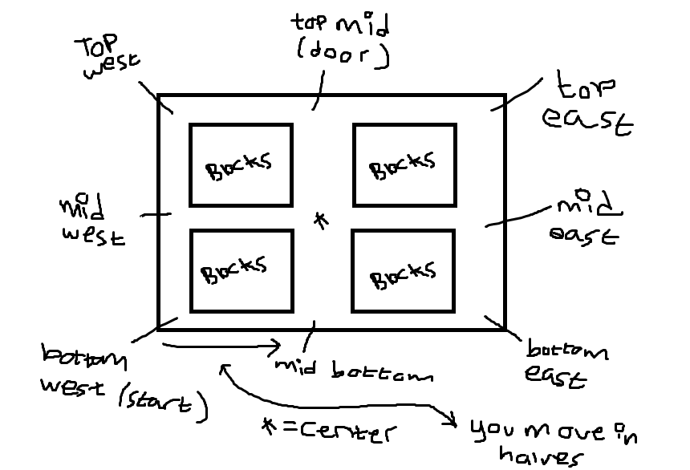

<h1>MyMaze</h1>
This is a simple text based maze game.
As it stands at the moment, it's just a very simple maze nagivation thingie magic.
 

 

excuse the terrible handwriting... My mouse is horrible.
Also, in case you get confused:  
<b> You move in increments of halves. So if you where to type 'e' from the start, you would
	move to mid bottom </b>
<h2>LICENCE</h2>
This "game" (if you wish to call it that) is released fully under the MIT licence.
Do what you want with the code. Not like you'll actually <i>want</i> to.
